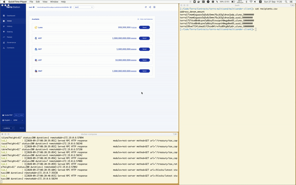

# CosmWasm Multisend Contract

This is a multisend smart contracts in Rust built tor run on
[Cosmos SDK](https://github.com/cosmos/cosmos-sdk) module on all chains that enable it.
The project was built and tested for the Terra network.

## What it does

This project covers all you need to build, deploy and interact with the smart contract on the Terra blockchain.
The main parts of the project are:

- The contract (this page)
- The deployment scripts in [scripts](./scripts)
- A basic CLI client application to send and receive Terra/Luna as well as interact with the deployed contract: [multisender-client](./multisender-client)

Each part has its own README and instructions

# Multisend Contract

The contract is written in `Rust` and is compiled to wasm. The contract receives a list of addresses and amounts, and distributes the passed coins to these addresses.
The amount sent to the contract must be enough to cover the outgoing payments.

## Prerequisites

Building the contract requires an up-to-date `Rust` version with `wasm` support.

```sh
rustup default stable
rustup target add wasm32-unknown-unknown
```

For further details, consult the official Terra [documentation](https://docs.terra.money/contracts/tutorial/setup.html#install-terra-core-locally) for setting up the environment.

As a live test environment, it is recommended to use [LocalTerra](https://github.com/terra-project/LocalTerra). Follow the installation process of LocalTerra in the link

## Building the contract

Clone the contract to a new environment.

```
git clone https://github.com/ZenGo-X/terra-multisend.git
```

Make sure the project compiles by running

```sh
cargo wasm
```

This will build an unoptimized version of the contract, just to make sure the compilation works. To build an optimized version that can be uploaded to the blockchain, run

```sh
docker run --rm -v "$(pwd)":/code \
  --mount type=volume,source="$(basename "$(pwd)")_cache",target=/code/target \
  --mount type=volume,source=registry_cache,target=/usr/local/cargo/registry \
  cosmwasm/rust-optimizer:0.10.3
```

More instructions on building and developing the contract in [Developing](./Developing.md)

Once the contract is compiled, go to [scripts](./scripts) to deploy the contract using `Terra.js`

## Contract use cases and limitations

The Terra blockchain supports sending multiple payments simultaneously via a `MsgMultiSend`. Still, the contract could be useful for several use cases:

- Integration with other smart contracts
- Sending ERC20/CW20 tokens (in future versions)
- Collecting payment for the provided service

The contract can be also easily extended to perform additional tasks, such as swapping tokens to the required coin etc.

## Contract Demo

In the demo, the contract sends a batch of transactors to the addresses specified in the CSV.
The The address of sending address gets funds removed, and added to the specified addresses.
This is easy to practice in LocalTerra, as it several addresses with funds for testing.
Do not use these addresses in production



## Misc

[Publishing](./Publishing.md) contains useful information on how to publish your the
contract, once you are ready to deploy it on a running blockchain.
[Importing](./Importing.md) contains information about pulling in other contracts or crates
that have been published.
